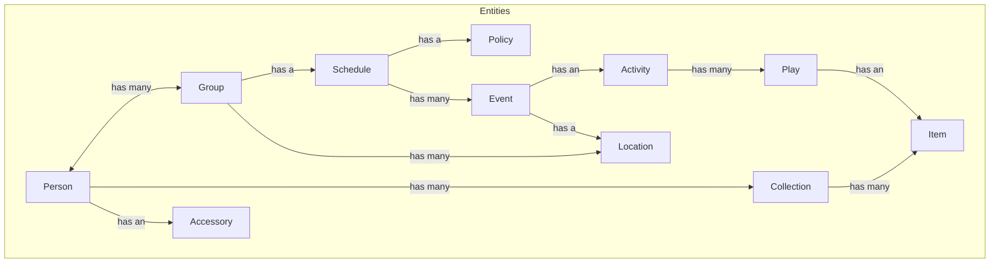

```mermaid
graph TD
    subgraph Entities
        direction LR
        Person
        Group
        Schedule
        Policy
        Event
        Location
        Activity
        Play
        Collection
        Item
        Accessory

        Person <-- "has many" --> Group
        Group -- "has a" --> Schedule
        Schedule -- "has a" --> Policy
        Schedule -- "has many" --> Event
        Event -- "has an" --> Activity
        Event -- "has a" --> Location
        Person -- "has many" --> Collection
        Person -- "has an" --> Accessory
        Group -- "has many" --> Location
        Activity -- "has many" --> Play
        Collection -- "has many" --> Item
        Play -- "has an" --> Item
    end

```
