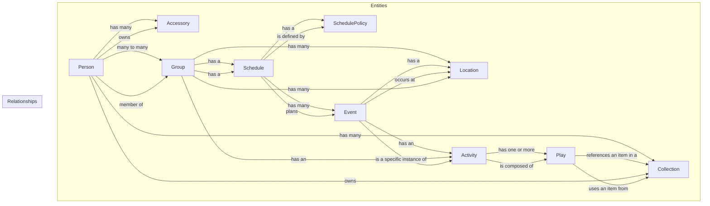

```mermaid
graph TD
    subgraph Entities
        direction LR
        Person
        Group
        Schedule
        SchedulePolicy
        Event
        Location
        Activity
        Play
        Collection
        Accessory
    end

    subgraph Relationships
        direction TB
        Person -- "has many" --> Collection
        Person -- "has many" --> Accessory
        Person -- "many to many" --> Group
        Group -- "has a" --> Schedule
        Group -- "has many" --> Location
        Schedule -- "has a" --> SchedulePolicy
        Schedule -- "has many" --> Event
        Event -- "has an" --> Activity
        Event -- "has a" --> Location
        Group -- "has an" --> Activity
        Activity -- "has one or more" --> Play
        Play -- "references an item in a" --> Collection
    end

    Person -- "member of" --> Group
    Group -- "has a" --> Schedule
    Schedule -- "is defined by" --> SchedulePolicy
    Schedule -- "plans" --> Event
    Event -- "is a specific instance of" --> Activity
    Event -- "occurs at" --> Location
    Person -- "owns" --> Collection
    Person -- "owns" --> Accessory
    Group -- "has many" --> Location
    Activity -- "is composed of" --> Play
    Play -- "uses an item from" --> Collection
```
